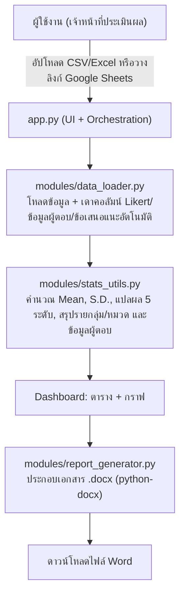

# OneClick Report — ระบบสรุปผลการประเมินโครงการอัตโนมัติ

Web Application (Streamlit) สำหรับแปลงข้อมูลจากแบบประเมินความพึงพอใจ (Google Form/CSV/Excel)
ให้กลายเป็นตารางค่าสถิติและรายงาน Word ที่พร้อมพิมพ์ — จบในหน้าเว็บเดียว ไม่ต้องเรียกใช้บริการภายนอกใด ๆ

---

## สารบัญ

1. [ภาพรวมสถาปัตยกรรมระบบ](#1-ภาพรวมสถาปัตยกรรมระบบ)
2. [โครงสร้างหน้า Dashboard](#2-โครงสร้างหน้า-dashboard)
3. [โครงสร้างไฟล์ในโปรเจกต์](#3-โครงสร้างไฟล์ในโปรเจกต์)
4. [คู่มือติดตั้งและใช้งานแบบ Step-by-step](#4-คู่มือติดตั้งและใช้งานแบบ-step-by-step)
5. [คำอธิบายการทำงานของโค้ดแต่ละส่วน](#5-คำอธิบายการทำงานของโค้ดแต่ละส่วน)
6. [ข้อจำกัดและข้อควรระวัง](#6-ข้อจำกัดและข้อควรระวัง)

---

## 1. ภาพรวมสถาปัตยกรรมระบบ

ระบบเป็นเว็บแอปหน้าเดียวแบบ Step Wizard รันด้วย Streamlit ทั้งหมด ไม่ต้องแยก
frontend/backend เพราะ Streamlit จัดการทั้งสองฝั่งให้ในตัว ทำงานอยู่ในเครื่อง/เซิร์ฟเวอร์ของคุณเอง
ทั้งหมด ไม่มีการส่งข้อมูลออกไปยังบริการภายนอก:



---

## 2. โครงสร้างหน้า Dashboard

หน้าเว็บออกแบบเป็น **Step Wizard** (ทำทีละขั้นตอนต่อเนื่องกัน) มีแถบความคืบหน้า (stepper)
แสดงตลอดว่าทำถึงขั้นไหนแล้ว:

```
┌──────────────────────────────────────────────────────────────────┐
│  ✓───✓───(●)───○         นำเข้าข้อมูล → ตั้งค่าคอลัมน์ →                │
│                            ผลสถิติ → ออกรายงาน                      │
│  ┌────────────────────────────────────────────────────────────┐  │
│  │  การ์ดเนื้อหาของขั้นตอนปัจจุบัน                                  │  │
│  └────────────────────────────────────────────────────────────┘  │
│  [← ย้อนกลับ]                                        [ถัดไป →]     │
└──────────────────────────────────────────────────────────────────┘
```

ไม่มี sidebar แยก — ทุกอย่างอยู่ในคอลัมน์เดียวกลางหน้าจอ มีแค่ปุ่ม "🔄 เริ่มใหม่" เล็ก ๆ
มุมขวาบน (ล้าง state ทั้งหมดกลับไปขั้นตอนที่ 1)

ทั้ง 4 ขั้นตอน:

1. **📤 นำเข้าข้อมูล** — อัปโหลดไฟล์หรือวางลิงก์ Google Sheets พร้อมตัวอย่างข้อมูล 5 แถวแรก
2. **⚙️ ตั้งค่าคอลัมน์** — ตาราง `st.data_editor` เดียว ติ๊กได้ 2 แบบต่อคอลัมน์:
   - **ข้อมูลผู้ตอบ** (เช่น เพศ, ตำแหน่ง) — เดาอัตโนมัติจากคอลัมน์ข้อความที่มีค่าไม่ซ้ำน้อย
   - **Likert (1-5)** — เดาอัตโนมัติจากคอลัมน์ตัวเลขในช่วง 1-5 พร้อมช่อง **"หมวด/ตอน"** ให้พิมพ์ชื่อ
     กลุ่ม/ด้านได้ (เว้นว่างได้ถ้าไม่ต้องการแยก) และเลือก **คอลัมน์ข้อเสนอแนะ** (ข้อความอิสระ) แยกต่างหาก
3. **📊 ผลสถิติ** — การ์ด n/Mean/ระดับ + ตารางข้อมูลผู้ตอบ (จำนวน/ร้อยละ) + ตาราง Mean/S.D. ไล่สีตามระดับ
   (แยกเป็นรายด้านอัตโนมัติถ้าตั้ง "หมวด/ตอน" ไว้ในขั้นตอนที่ 2) + กราฟแท่ง (คำนวณสดใหม่ทุกครั้ง
   ไม่มีปุ่ม "ประมวลผล" แยกต่างหาก)
4. **📄 ออกรายงาน** — ใส่ชื่อโครงการ/ช่วงเวลา/สถานที่จัดกิจกรรม + ปุ่มดาวน์โหลด .docx
   (สร้างในหน่วยความจำ ไม่เขียนไฟล์ลงดิสก์)

กดย้อนกลับไปแก้ขั้นตอนก่อนหน้าได้เสมอโดยไม่เสียข้อมูลที่ทำไปแล้ว (เก็บใน `st.session_state`)

**โทนสี/ธีม**: ใช้ฟอนต์ Kanit (ฟอนต์ไทยที่ใช้กันแพร่หลายในดิจิทัลเซอร์วิสยุคใหม่) และโทนสีม่วง-น้ำเงิน
สดใส (`#7C3AED` → `#6366F1`) สำหรับปุ่มหลักและ stepper, เขียว/เหลือง/แดงสำหรับระดับผลประเมิน
เพื่อให้ดูทันสมัยและอ่านผลได้ไวขึ้น

**โครงสร้างรายงาน Word** อิงตามรูปแบบเอกสารสรุปผลการประเมินโครงการที่ใช้งานจริงในหน่วยงาน (ฟอนต์
TH SarabunPSK, กระดาษ A4, ระยะขอบตามมาตรฐานเอกสารราชการ) ประกอบด้วย:

1. ปก (ชื่อโครงการ, ช่วงเวลา, สถานที่)
2. รูปแบบการประเมินผล (จำนวนตอน, จำนวนผู้ตอบ)
3. เกณฑ์การประเมิน (ตารางแปลผล 5 ระดับ)
4. ผลการประเมิน — ตารางข้อมูลผู้ตอบ (ถ้าเลือกไว้) + ตารางค่าเฉลี่ย/S.D. รายด้าน (มีแถว "ค่าเฉลี่ยด้าน..."
   สรุปท้ายแต่ละกลุ่มถ้าตั้งกลุ่มไว้ในขั้นตอนที่ 2)
5. ข้อเสนอแนะอื่น ๆ (รายการข้อความดิบจากผู้ตอบ ถ้าเลือกคอลัมน์ไว้)

หากไม่ตั้งค่า "หมวด/ตอน" ให้คอลัมน์ใดเลย ระบบจะย่อส่วนที่ 4 กลับเป็นตารางเดียวแบบเรียบง่าย
(ไม่มีหัวข้อกลุ่ม/แถวสรุปย่อย) โดยอัตโนมัติ

---

## 3. โครงสร้างไฟล์ในโปรเจกต์

```
OneClick Report/
├── app.py                       # หน้าเว็บหลัก (รันด้วย streamlit run app.py)
├── requirements.txt             # รายการไลบรารีที่ต้องติดตั้ง
├── .gitignore
├── modules/
│   ├── data_loader.py           # โหลด CSV/Excel/Google Sheets + เดาคอลัมน์ Likert/ผู้ตอบ/ข้อเสนอแนะ
│   ├── stats_utils.py           # คำนวณ Mean/S.D., แปลผล 5 ระดับ, สรุปรายกลุ่มและข้อมูลผู้ตอบ
│   └── report_generator.py      # สร้างไฟล์ Word (.docx)
└── sample_data/
    ├── generate_sample.py       # สคริปต์สร้างข้อมูลตัวอย่าง (ไว้ทดสอบเท่านั้น)
    └── sample_evaluation.csv    # ข้อมูลตัวอย่าง ใช้ทดลองระบบได้ทันที
```

---

## 4. คู่มือติดตั้งและใช้งานแบบ Step-by-step

> โปรเจกต์นี้ได้ตั้งค่า virtual environment (`.venv`) และติดตั้งไลบรารีทั้งหมดไว้ให้เรียบร้อยแล้ว
> ระหว่างการสร้างระบบ (ทดสอบผ่านแล้วด้วยข้อมูลตัวอย่าง) หากใช้งานบนเครื่องเดิม **ข้ามไป Step 4 ได้เลย**
> ขั้นตอนด้านล่างมีไว้สำหรับกรณีย้ายโปรเจกต์ไปเครื่องอื่น หรือ setup ใหม่ตั้งแต่ต้น

### Step 1 — ติดตั้ง Python

ต้องมี Python 3.9 ขึ้นไป ตรวจสอบด้วยคำสั่ง:

```bash
python3 --version
```

หากยังไม่มี ดาวน์โหลดได้ที่ [python.org/downloads](https://www.python.org/downloads/)

### Step 2 — สร้าง Virtual Environment

เปิด Terminal แล้วเข้าไปที่โฟลเดอร์โปรเจกต์ จากนั้นสร้างและเปิดใช้งาน venv:

```bash
cd "OneClick Report"
python3 -m venv .venv
source .venv/bin/activate
```

(บน Windows ใช้ `.venv\Scripts\activate` แทนบรรทัดสุดท้าย)

### Step 3 — ติดตั้งไลบรารีที่จำเป็น

```bash
pip install -r requirements.txt
```

### Step 4 — รันเว็บแอปพลิเคชัน

```bash
streamlit run app.py
```

เบราว์เซอร์จะเปิดขึ้นอัตโนมัติที่ `http://localhost:8501` (ถ้าไม่เปิดเอง ให้คลิกลิงก์ที่ปรากฏใน Terminal)

### Step 5 — ทดลองใช้งานด้วยข้อมูลตัวอย่าง

1. ขั้นตอนที่ 1 เลือก "อัปโหลดไฟล์ (CSV/Excel)" แล้วลากไฟล์ `sample_data/sample_evaluation.csv` มาวาง
   แล้วกด **"ถัดไป →"**
2. ขั้นตอนที่ 2 ระบบเดาคอลัมน์ข้อมูลผู้ตอบ/Likert/ข้อเสนอแนะให้อัตโนมัติ (ติ๊ก/ปรับแก้ในตารางได้ —
   ลองพิมพ์ชื่อกลุ่มในช่อง "หมวด/ตอน" เพื่อดูตารางแยกรายด้านในขั้นตอนถัดไป) แล้วกด **"ถัดไป →"**
3. ขั้นตอนที่ 3 ดูตารางข้อมูลผู้ตอบ, ตารางค่าเฉลี่ย/S.D. พร้อมแปลผลและกราฟ แล้วกด **"ถัดไป →"**
4. ขั้นตอนที่ 4 ใส่ชื่อโครงการ/ช่วงเวลา/สถานที่ (ถ้ามี) แล้วกด **"📥 Export to Word (.docx)"**

### ขั้นตอนสำหรับใช้งานจริง (ข้อมูลจาก Google Form ของคุณเอง)

1. เปิด Google Sheet ที่เชื่อมกับ Google Form (แท็บ "Responses" ของฟอร์ม → ไอคอน Sheets สีเขียว)
2. ตั้งค่าการแชร์เป็น **"ทุกคนที่มีลิงก์ดูได้" (Anyone with the link can view)**
   (หรือจะ File → Download → CSV มาอัปโหลดแทนก็ได้ ไม่ต้องแชร์สาธารณะ)
3. ในขั้นตอนที่ 1 ของเว็บแอป เลือก "Google Sheets" คัดลอกลิงก์มาวาง แล้วกด "ดึงข้อมูลจาก Google Sheets"
4. ทำตาม Step 5 ข้อ 2-4 ด้านบนต่อได้เลย

---

## 5. คำอธิบายการทำงานของโค้ดแต่ละส่วน

### `modules/data_loader.py`
- `load_csv()` ไล่ลอง encoding หลายแบบ (`utf-8-sig`, `utf-8`, `cp874`, `tis-620`) เพราะไฟล์ CSV
  ที่ export จาก Excel บน Windows ภาษาไทยมักไม่ใช่ UTF-8
- `detect_likert_columns()` เดาว่าคอลัมน์ไหนเป็นคำถามมาตราส่วน 1-5 โดยดูว่าเป็นตัวเลขและอยู่ในช่วง 1-5
  เกิน 80% ของข้อมูล
- `detect_categorical_columns()` เดาคอลัมน์ข้อมูลผู้ตอบ (เพศ, ตำแหน่ง ฯลฯ) จากคอลัมน์ข้อความที่มีค่า
  ไม่ซ้ำน้อย (≤12 ค่า) — ข้อความอิสระอย่างข้อเสนอแนะจะมีค่าเกือบไม่ซ้ำกันเลย จึงหลุดเกณฑ์นี้ไปเอง
- `detect_feedback_column()` เดาคอลัมน์ข้อเสนอแนะจากชื่อคอลัมน์ก่อน ถ้าไม่เจอจะเดาจากความยาวข้อความเฉลี่ย
- `gsheet_url_to_csv()` แปลงลิงก์ Google Sheets ทั่วไปให้เป็นลิงก์ export CSV โดยตรง

### `modules/stats_utils.py`
- `interpret_mean()` แปลค่าเฉลี่ยเป็นระดับ 5 ระดับตามเกณฑ์ที่กำหนด
- `calculate_statistics()` คำนวณ Mean/S.D./แปลผลของทุกคอลัมน์ที่เลือก คืนค่าเป็นตารางเดียว
- `overall_summary()` สรุปภาพรวมจากค่าเฉลี่ยของค่าเฉลี่ยทั้งหมด (ใช้แสดงในขั้นตอนที่ 3)
- `calculate_grouped_statistics()` แบ่งผลตาม "หมวด/ตอน" ที่ผู้ใช้ตั้งไว้ คืนค่าเป็นลิสต์ของกลุ่ม
  แต่ละกลุ่มมีทั้งตารางรายข้อและค่าเฉลี่ยรวมของกลุ่มนั้น — ถ้าไม่มีการตั้งกลุ่มเลย ทุกคอลัมน์จะรวมอยู่ใน
  กลุ่มเดียวชื่อ `DEFAULT_GROUP_NAME` ซึ่ง `app.py`/`report_generator.py` ใช้เช็คเพื่อย่อกลับเป็น
  ตารางเดียวแบบเรียบง่าย
- `calculate_demographics()` สรุปจำนวน/ร้อยละของผู้ตอบแยกตามคอลัมน์ข้อมูลผู้ตอบ พร้อมแถวรวมท้ายตาราง

### `modules/report_generator.py`
- ใช้ `python-docx` สร้างเอกสาร Word ในหน่วยความจำ (`io.BytesIO`) ไม่เขียนไฟล์ชั่วคราวลงดิสก์
- ตั้งฟอนต์ **TH SarabunPSK** (ตรงกับเอกสารสรุปผลการประเมินโครงการที่ใช้งานจริง) ให้ครบทั้ง
  `ascii`/`eastAsia`/`cs` ในทุก run — จุดที่มักพลาดคือถ้าตั้งแค่ชื่อฟอนต์เฉย ๆ Word บางเครื่องจะ
  fallback ไปฟอนต์อื่นกับตัวอักษรไทย ทำให้สระ/วรรณยุกต์แสดงผลเพี้ยน
- ตารางค่าเฉลี่ยรายด้าน (กรณีมีมากกว่า 1 กลุ่ม) ใช้ตารางต่อเนื่องตารางเดียว ไม่แยกตารางต่อกลุ่ม
  (ตรงกับรูปแบบเอกสารตัวอย่างจริง) โดยแถวหัวข้อกลุ่มทำด้วยการ merge เซลล์ 4 ช่องในแถวเดียวกัน

### `app.py`
- ควบคุมขั้นตอนปัจจุบันด้วย `st.session_state.step` (1-4) แสดงเนื้อหาแบบ `if/elif` ทีละขั้น และ
  render แถบ stepper เองด้วย HTML/CSS ล้วน (ไม่มี widget stepper สำเร็จรูปใน Streamlit)
- ค่าสถิติ (`compute_flat_stats()`, `compute_grouped_stats()`, `compute_demographics()`) คำนวณสดใหม่
  ทุกครั้งที่เข้าขั้นตอนที่ 3 หรือ 4 (ไม่ cache) เพราะคำนวณเร็ว และกันปัญหาข้อมูลค้าง (stale)
  หากย้อนกลับไปแก้คอลัมน์ในขั้นตอนที่ 2 แล้วมาใหม่
- CSS ที่ฉีดผ่าน `st.markdown(..., unsafe_allow_html=True)` ต้อง**เขียนแบบไม่มี indent นำหน้าแต่ละบรรทัด**
  ในตัวแปร string — ถ้า indent เหมือนโค้ด Python ปกติ ตัว Markdown parser ของ Streamlit จะตีความว่าเป็น
  code block (เพราะข้อความย่อหน้า 4 ช่องขึ้นไปคือ syntax ของ Markdown code block) แล้วแสดง CSS/HTML
  เป็นข้อความดิบบนหน้าเว็บแทนที่จะ apply เป็นสไตล์จริง
- มีการเทียบ `file_id` ของไฟล์ที่อัปโหลด เพื่อแยกแยะ "อัปโหลดไฟล์ใหม่จริง ๆ" ออกจาก
  "หน้าเว็บ rerun จากการกดปุ่มอื่นที่ไม่เกี่ยวกับการโหลดข้อมูล" — ถ้าไม่ทำเช่นนี้ การตั้งค่าคอลัมน์
  ที่ทำไว้แล้วจะถูกล้างทิ้งทุกครั้งที่กดปุ่มใด ๆ ในหน้าเว็บ (เป็นพฤติกรรมเฉพาะของ
  `st.file_uploader` ที่ยังคงค่าไฟล์เดิมไว้ทุกครั้งที่ rerun)

---

## 6. ข้อจำกัดและข้อควรระวัง

- **Google Sheets ต้องแชร์แบบสาธารณะ** (Anyone with the link can view) เพราะระบบดึงข้อมูลผ่านลิงก์
  export CSV โดยตรง ไม่ได้ใช้ OAuth/Service Account — หากข้อมูลมีความอ่อนไหว แนะนำใช้วิธีดาวน์โหลด
  เป็นไฟล์แล้วอัปโหลดแทน
- **การเปิดให้เข้าถึงผ่านเครือข่าย**: คำสั่ง `streamlit run app.py` อาจแสดง "Network URL"/"External URL"
  ให้เครื่องอื่นในเครือข่ายเดียวกันเข้าถึงได้ด้วย หากไม่ต้องการให้เข้าถึงได้ ให้รันเฉพาะในเครื่องและปิด
  network/firewall ตามความเหมาะสม
- **รูปแบบคอลัมน์ Likert**: ระบบเดาคอลัมน์อัตโนมัติจากค่าตัวเลข 1-5 หากแบบฟอร์มของคุณใช้มาตราส่วนอื่น
  (เช่น 1-7 หรือ 1-10) ต้องปรับเกณฑ์ใน `data_loader.detect_likert_columns()` และเกณฑ์แปลผลใน
  `stats_utils.py` ให้ตรงกับแบบฟอร์มที่ใช้จริง
